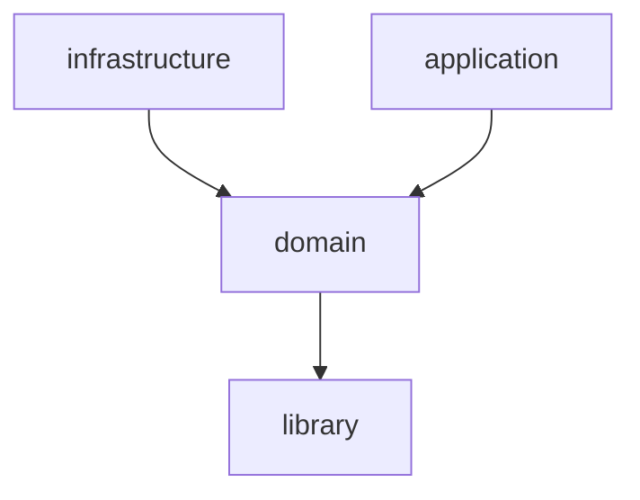

# Spring Boot アプリケーションを multi module で構成する

## 概要

### 環境

- Windows10
- Spring Boot v2.7.10
- Java 1.8
- maven 3.9.0

### 参考

- [マルチモジュールプロジェクトの作成](https://spring.pleiades.io/guides/gs/multi-module/)
- [Spring Bootアプリケーションをmavenのmulti moduleで構成する](https://qiita.com/rubytomato@github/items/118817023845b4284553)

## プロジェクト

| モジュール | ルートパッケージ | 説明 |
| :--- | :--- | :--- |
| library | com.example.sandbox | TD |
| domain | com.example.sandbox.domain | TD |
| infrastructure | com.example.sandbox.infrastructure | TD |
| application | com.example.sandbox | TD |

Here is a module dependencies:

